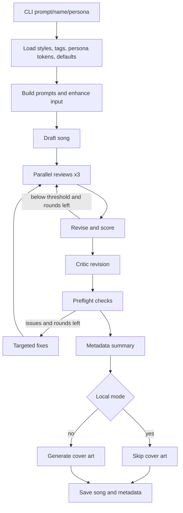

# Song Master

A powerful (yet easy to use) script for generating song lyrics using AI models, specifically designed for creating Suno AI-compatible songs with custom styles, metadata, and structured formatting.

## Overview

Song Master is a Python script that leverages AI models (both local and OpenRouter) to generate complete song lyrics with proper formatting, style tags, and metadata for Suno AI. It includes pre-flight checks, song drafting, and review processes to ensure high-quality output.

## Features

- **Dual AI Support**: Works with both local AI models and OpenRouter API
- **Structured Output**: Generates Suno AI-compatible format with styles, metadata, and lyrics
- **Pre-flight Checks**: Validates prompts and suggests improvements before generation
- **Custom Styles**: Supports custom style definitions and tagging
- **Metadata Generation**: Automatically generates emotional arc, target audience, and commercial potential data
- **Review Process**: Built-in song review and refinement capabilities

## Installation

1. Clone the repository:
```bash
git clone https://github.com/your-username/song-master.git
cd song-master
```

2. Install dependencies:
```bash
pip install -r requirements.txt
```

3. Set up environment variables:
```bash
cp .env.example .env
# Edit .env with your API keys and configuration
```

## Usage

### Basic Usage

```bash
python song_master.py "Your song prompt here"
```

### With Local Model

```bash
python song_master.py "Your song prompt here" --local
```

### With Prompt File

```bash
python song_master.py --prompt-file path/to/prompt.txt
```

### With Custom Song Name

```bash
python song_master.py "Your song prompt here" --name "My Song Title"
```

### With Persona

```bash
python song_master.py "Your song prompt here" --persona "antidote"
```

### Regenerate Cover Art

```bash
python song_master.py --regen-cover path/to/song.md
```

### Command Line Options

- `prompt`: The song description or request (optional if using --prompt-file)
- `--prompt-file`: Path to a .txt file containing the song description
- `--local`: Use local LM Studio LLM and disable image generation
- `--name`: Optional song name/title
- `--persona`: Specify persona by name or path to persona .md file
- `--regen-cover`: Path to existing song file to regenerate album art

## Examples

### Example Input

The following input was used to generate the example outputs:

```
Generate some lyrics for a song that's all about testing ideas. Make it in the style of an 80s hair band and give it a thumping beat.
```

### Local Model Output

The local model generates a more narrative-focused song with detailed storytelling:

**Audio Sample:**
<video controls="" autoplay="" name="media">
  <source src="examples/local/Testing_Ideas_Local.mp3" type="audio/mp3">
  Your browser does not support the audio element.
  <a href="examples/local/Testing_Ideas_Local.mp3">Download the audio file</a>
</video>

```markdown
## Testing Ideas
### A powerful 80s hair metal anthem about confronting inner doubts and boldly testing personal truths, driven by explosive guitar riffs, pounding drums, and a soaring, anthemic chorus. The song blends raw emotional intensity with glam rock swagger and stadium-ready energy.

## Suno Styles
80s hair metal, glam rock, arena rock, explosive guitar riffs, pounding drums, anthemic, party anthem, high-energy, melodic hooks, gang vocals, power ballad dynamics, rock and roll lifestyle, catchy chorus, guitar solo, festive, passionate, raw energy, stadium rock, glam metal swagger, Spatial Audio, Dolby Atmos mix, high-fidelity

## Suno Exclude-styles
melodic hooks, catchy chorus

## Additional Metadata
- **Emotional Arc**: happy
- **Target Audience**: Fans of classic 80s rock, arena rock enthusiasts, and listeners who enjoy high-energy, emotionally charged performances with a nostalgic edge.
- **Commercial Potential**: High — ideal for rock radio, sports events, and nostalgic playlists, with strong potential as a viral anthem for self-empowerment and personal breakthrough.
- **Technical Notes**: BPM: 120, Key: C, Instruments: guitar,bass,drums
- **User Prompt**: Generate some lyrics for a song that's all about testing ideas. Make it in the style of an 80s hair band and give it a thumping beat.

### Song Lyrics:
## Testing Ideas

[Verse 1]  
Cracked coffee cup on the kitchen sink,  
Steam still rising—water's been cold for hours.  
A letter folded twice in my coat pocket—  
The name I wrote, then erased, then rewrote.  
Saw it in the subway light,  
A face I still see in every mirror.  
No map, no proof—just the weight of a word  
I've carried since the night you left.

[Pre-Chorus]  
I don't need a name,  
I don't need a stage—  
The silence broke, and my voice found its way.  
Got the wound, got the truth,  
Gonna say it now—no more running.

[Chorus]  
Feel the rush, feel the rise—  
No fear, no lie—just the truth that won't stay quiet.  
One breath, and the air went still—  
The world held its breath, and I heard my own name.  
Yeah, I'm testin' ideas,  
Gonna break the mold, gonna make it real—  
One word, and the silence breaks.

[Verse 2]  
Wired for waiting, built for the pause,  
Got a line I've written, and I'm gonna say it.  
From the train's cold hum to the stair's worn wood,  
From the silence to the breath I've been afraid to say.  
I don't care if it's right or wrong—  
If it breaks, it's already strong.  
Got a rhythm in my throat,  
A truth I've been afraid to speak—  
And I've been told I'm too soft to be heard.

[Pre-Chorus]  
I don't need a plan,  
I don't need a plan—  
The silence broke, and my voice found its way.  
Got the fire, got the drive,  
Gonna light it up, gonna give it life.

[Chorus]  
Feel the rush, feel the rise—  
No fear, no lie—just the truth that won't stay quiet.  
One breath, and the air went still—  
The world held its breath, and I heard my own name.  
Yeah, I'm testin' ideas,  
Gonna break the mold, gonna make it real—  
One word, and the silence breaks.

[Bridge]  
No second guess, no time to wait—  
The world's a cup, and I'm the hand that holds it.  
I don't need a name, I don't need a crown—  
Just the word I've been afraid to say.

[Guitar Solo — bendy, bluesy, soaring over pounding drums]  
[Big Finish]  
[Explosive Riff]  
[Choir]  
[Male Vocal]  
[Chorus — Gang Vocals, Anthemic, Full Band]  
Feel the rush, feel the rise—  
No fear, no lie—just the truth that won't stay quiet.  
One breath, and the air went still—  
The world held its breath, and I heard my own name.  
Yeah, I'm testin' ideas,  
Gonna break the mold, gonna make it real—  
One word, and the silence breaks.

[Outro]  
[Fade Out and End]  
[End]  
[Big Finish]  
[Powerful Outro]  
[Fading, layered, triumphant]
```

### OpenRouter Model Output

The OpenRouter model generates a more energetic, performance-focused song with explicit style tags:

**Audio Sample:**
<audio controls muted>
  <source src="examples/openrouter/Testing_Ideas_Openrouter.mp3" type="audio/mp3">
  Your browser does not support the audio element.
  <a href="examples/openrouter/Testing_Ideas_Openrouter.mp3">Download the audio file</a>
</audio>

```markdown
## Testing Ideas
### High‑energy 80s hair‑metal anthem about bold creativity and pushing ideas into the spotlight with swagger and arena‑rock power.

## Suno Styles
80s hair metal, glam rock, arena rock, anthemic, high-energy, glam metal, party anthem, explosive guitar riffs, pounding drums, melodic hooks, gang vocals, power ballad dynamics, rock and roll lifestyle, catchy chorus, guitar solo, festive, passionate, raw energy, stadium rock, glam metal swagger, Spatial Audio, Dolby Atmos mix, high-fidelity

## Suno Exclude-styles
None

## Additional Metadata
- **Emotional Arc**: happy
- **Target Audience**: Fans of 80s rock, glam metal, and energetic stadium‑style anthems.
- **Commercial Potential**: Strong potential for nostalgia‑driven rock playlists and high‑energy promotional use.
- **Technical Notes**: BPM: 120, Key: C, Instruments: guitar,bass,drums
- **User Prompt**: Generate some lyrics for a song that's all about testing ideas. Make it in the style of an 80s hair band and give it a thumping beat.

### Song Lyrics:
## Testing Ideas

[Intro] [style: 80s hair metal, glam rock, arena rock, party anthem, high-energy]  
Lights rise, crowds surge, hearts rumble through the night  
We cut the neon haze, break open the sky's white  

[Verse 1] [style: 80s hair metal]  
Got a wild plan ridin' on the restless air  
Clear visions sparkin' as the brave ones dare  
Chasin' echoes down a half‑lit road  
Every bold impulse primed to overload  

[Pre-chorus] [style: glam rock]  
Turn it up, turn it up, feel the pull draw near  
Unchained heartbeats roarin' loud and clear  

[Chorus] [style: arena rock, anthemic]  
We're breakin' the silence, makin' truth reveal  
Pushin' the edge till the moment feels real  
Cut through the doubt, shake off the old fear  
Lift your voice high — we're breakin' the silence  

[Verse 2] [style: hair metal swagger]  
Got a live spark rollin' through the riff  
A shockwave risin' with a skyline lift  
Every wrong turn feeds fire to our mark  
We carve our path with voices cuttin' the dark  

[Pre-chorus] [style: glam metal]  
Turn it up, turn it up, let the weight fall free  
Every strike we throw's a raw victory  

[Chorus] [style: arena rock, anthemic]  
We're breakin' the silence, makin' truth reveal  
Pushin' the edge till the moment feels real  
Cut through the doubt, shake off the old fear  
Lift your voice high — we're breakin' the silence  

[Guitar Solo — wild, bend-heavy, high-energy]

[Bridge] [style: power ballad dynamics]  
When the world says "stop," we just shout back "go!"  
Every spark hits harder, drivin' through the low  
Hold tight to the madness, feel the quake come down  
We light the whole sky up every time we stand our ground  

[Chorus] [style: arena rock + gang vocals]  
We're breakin' the silence, makin' truth reveal  
Pushin' the edge till the moment feels real  
Cut through the doubt, shake off the old fear  
Lift your voice high — we're breakin' the silence  

[Big Finish]  
Breakin' the silence — keep shoutin' through the years!
```

### Cover Art Output

The script also generates cover art for the songs. Here's an example of the cover art created for the "Testing Ideas" song:


## Key Differences Between Models

| Aspect | Local Model | OpenRouter Model |
|--------|-------------|------------------|
| **Style** | More narrative and emotional | More energetic and performance-focused |
| **Structure** | Traditional verse-chorus structure | Explicit style tags per section |
| **Content** | Storytelling with personal elements | Direct and energetic messaging |
| **Formatting** | Standard formatting | Detailed style annotations |
| **Exclude Styles** | Specific exclusions (melodic hooks, catchy chorus) | No exclusions |

## Configuration

### Environment Variables

Create a `.env` file with the following variables:

```env
# OpenRouter API Key (optional, for OpenRouter provider)
OPENROUTER_API_KEY=your_api_key_here

# Local Model Configuration
LOCAL_MODEL_PATH=path/to/your/model
LOCAL_MODEL_HOST=localhost
LOCAL_MODEL_PORT=8080

# Output Configuration
OUTPUT_DIR=./output
EXAMPLES_DIR=./examples
```

### Custom Styles

Edit `styles/styles.json` to add custom style definitions:

```json
{
  "custom_styles": {
    "your_style": {
      "description": "Description of your style",
      "tags": ["tag1", "tag2", "tag3"],
      "exclude_tags": ["exclude1"]
    }
  }
}
```

## Technical Deep Dive: Agentic Songwriting Flow

- **Orchestration (`song_master.py`)**: A LangGraph `StateGraph` wires together the agentic steps and keeps shared state (lyrics, score, metadata, persona, resources, round counters). The CLI parses prompt/name/persona/local-mode flags and seeds the graph with defaults from `.env`.
- **Resource loading (`helpers.load_resources`)**: Styles from `styles/styles.json`, tag snippets in `tags/*.txt`, persona-specific style tokens from `personas/*.md`, and baseline song params (genre/tempo/key/instruments/mood). Persona style tokens get re-used later to bias metadata and tags.
- **Prompt assembly (`ai_functions.build_prompts`)**: The drafter/reviewer/critic/preflight/revision/scoring/metadata prompts are built once, with the styles/tags/persona tokens inlined so every call has the same grounding data.
- **Drafting (`draft_node`)**: User input is optionally titled, then sent to the drafter LLM with styles, tags, persona styles, and defaults. The LLM backend is chosen at runtime (local LM Studio via OpenAI-compatible API, LiteLLM relay, OpenRouter, or OpenAI) based on env vars.
- **Parallel review loop (`review_node`)**: Three reviewers run in parallel threads (`run_parallel_reviews`), feedback is merged, `revise_lyrics` applies the edits, and `score_lyrics` parses a JSON score. The graph loops review rounds until the score crosses `REVIEW_SCORE_THRESHOLD` or `REVIEW_MAX_ROUNDS`.
- **Critic pass (`critic_node`)**: A single critic prompt adds a last improvement pass before safety/format checks.
- **Preflight + targeted fixes (`preflight_node` → `targeted_revise_node`)**: Lyrics are validated against style/tag rules. `triage_preflight` distills LLM feedback into a boolean pass + issue list; any issues trigger a targeted revision loop (and another review cycle) until resolved or rounds are exhausted.
- **Metadata + cover art (`metadata_node` → `album_art_node`)**: The metadata agent emits JSON (description, Suno styles/exclude, target audience, commercial potential) and injects persona style tokens to keep the song “on persona.” Album art is generated unless `--local` is set; regeneration can be run directly with `--regen-cover`.
- **Persistence (`save_node`)**: The final song, metadata, and user prompt are saved to `songs/{YYYYMMDD}_{Title}.md`, with optional `{Title}_cover.jpg` beside it.




## Project Structure

```
song-master/
├── README.md                 # This file
├── song_master.py           # Main script
├── ai_functions.py          # AI interaction functions
├── helpers.py               # Utility functions
├── requirements.txt         # Python dependencies
├── .env.example            # Environment variables template
├── examples/               # Example outputs
│   ├── local/             # Local model examples
│   ├── openrouter/        # OpenRouter model examples
│   └── testing-ideas.txt  # Example input
├── prompts/               # AI prompts
├── styles/               # Style definitions
├── personas/             # AI personas
└── tags/                 # Default tags
```

## Contributing

1. Fork the repository
2. Create a feature branch
3. Make your changes
4. Add tests if applicable
5. Submit a pull request

## License

This project is licensed under the MIT License - see the LICENSE file for details.

## Support

For issues and questions:
- Create an issue on GitHub
- Check the examples directory for reference outputs
- Review the prompts directory for AI interaction templates
