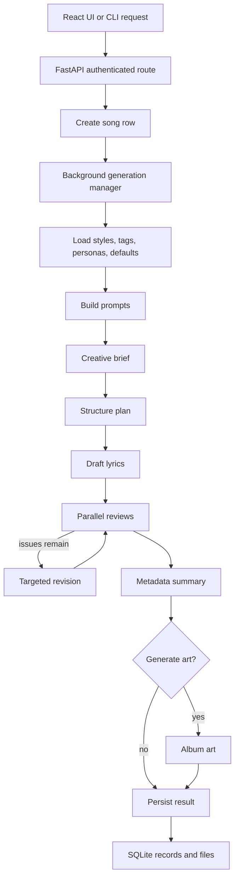

# Song Master

Song Master is a container-first full-stack app for generating and managing AI-assisted, Suno-compatible songs. The current app is built around a FastAPI backend, a Vite + React TypeScript frontend, SQLite persistence, authenticated user workspaces, and a LangGraph-backed songwriting pipeline.

The web UI is now the primary product experience. The CLI still exists as a thin helper client in `cli/song_master.py`, but generation work is owned by the backend.

## Current Capabilities

- **Authenticated workspace**: Sign up or log in through the React app. API resources are bearer-token/JWT protected and scoped to the current user.
- **Song generation**: Generate songs from a prompt with persona, style, genre, tempo, key, instruments, mood, vocal, rhyme, and cover-art controls.
- **Song proposals**: Generate structured song ideas first, then promote a proposal into the generation workflow.
- **Live progress**: Track generation through HTTP status polling and authenticated WebSocket updates.
- **Library management**: Browse songs and albums with search, filters, sorting, grid/list views, imports, and detail pages.
- **Lyrics workflow**: Edit lyrics, keep version history, compare versions, regenerate lyrics, and view clean lyrics without style tags.
- **Artwork workflow**: Generate, regenerate, upload, and track song or album artwork.
- **Demo tracks**: Create MiniMax-backed MP3 demo tracks from completed remote-generation songs.
- **Live Listen feedback**: Upload an MP3 for AI feedback and lyric revision.
- **Backup/restore**: Export and restore account-owned songs, albums, proposals, lyric history, settings, and files.
- **Persona management**: Create, edit, delete, and apply markdown-backed personas.

## Stack

- **Backend**: FastAPI, SQLAlchemy, SQLite, Pydantic settings, in-process background generation tasks
- **Frontend**: React 18, TypeScript, Vite, React Router, TanStack React Query, Axios
- **Realtime**: WebSocket endpoint at `/ws/songs/{song_id}/progress`
- **Storage**: SQLite in `backend/data/song_master.db`, generated files under `songs/` and `images/`
- **Local orchestration**: Docker Compose

## Quick Start

Use Docker Compose for local development. The repo is intended to run as containers rather than through a host Python virtualenv or host npm install.

1. Clone and enter the repo:

```bash
git clone https://github.com/robertrittmuller/song-master.git
cd song-master
```

2. Create your environment file:

```bash
cp .env.example .env
```

Edit `.env` with the API keys and defaults you need. At minimum, remote song generation needs an OpenRouter/LiteLLM-compatible key. Demo-track creation needs MiniMax credentials.

3. Start the stack:

```bash
docker compose up --build
```

If your environment uses the older Compose binary:

```bash
docker-compose up --build
```

4. Open the app:

- Frontend: <http://localhost:5173>
- Backend API: <http://localhost:8000>
- API docs: <http://localhost:8000/docs>
- Health endpoint: <http://localhost:8000/healthz>

The first browser visit should go to signup/login. After signup, the frontend stores the bearer token in local storage and attaches it to API and WebSocket requests.

## Common Development Commands

Run these from the repo root.

```bash
# Start containers
docker compose up

# Rebuild images
docker compose build

# Install frontend dependencies inside the frontend container
docker compose exec frontend npm install

# Build the frontend inside the frontend container
docker compose exec frontend npm run build

# Run backend unit tests inside the backend container
docker compose exec backend python -m unittest discover tests

# Check backend logs
docker compose logs backend

# Check frontend logs
docker compose logs frontend
```

`frontend/package.json` currently has a placeholder `lint` script and no real test script.

## Configuration

The template lives in `.env.example`. Important settings include:

```env
# Remote LLM / OpenRouter-compatible usage
OPENROUTER_API_KEY=your_openrouter_api_key_here
LITELLM_MODEL=openrouter/openai/gpt-5.1-chat
LITELLM_API_KEY=${OPENROUTER_API_KEY}
LITELLM_API_BASE=https://openrouter.ai/api/v1
LITELLM_MULTIMODAL_MODEL=openrouter/google/gemini-3-flash-preview
LITELLM_IMAGE_MODEL=google/gemini-3-pro-image-preview

# MiniMax demo-track generation
MINIMAX_API_KEY=your_minimax_api_key_here
MINIMAX_MUSIC_MODEL=music-2.6
MINIMAX_API_BASE=https://api.minimax.io/v1
MINIMAX_REQUEST_TIMEOUT=180

# LM Studio local mode
LMSTUDIO_API_KEY=
LMSTUDIO_BASE_URL=http://localhost:1234/v1
LMSTUDIO_LLM_MODEL=qwen/qwen3-30b-a3b-2507

# Generation defaults
LLM_MAX_TOKENS=8192
LLM_TEMPERATURE=0.7
REVIEW_MAX_ROUNDS=3
DEFAULT_SONG_GENRE=rock
DEFAULT_PERSONA=None
DEFAULT_TEMPO=120
DEFAULT_KEY=C
DEFAULT_INSTRUMENTS=guitar,bass,drums
DEFAULT_MOOD=happy

# App and auth
SONG_MASTER_API_BASE=http://localhost:8000
SECRET_KEY=replace_with_a_long_random_secret
JWT_ALGORITHM=HS256
ACCESS_TOKEN_EXPIRE_MINUTES=10080
```

Settings exposed to the frontend are read-only and assembled server-side from environment/default values.

## Web App Workflow

1. Sign up or log in.
2. Optionally create personas or generate song proposals.
3. Generate a song from `/generate`.
4. Watch progress on the generation screen.
5. Review the completed song detail page.
6. Edit lyrics, compare versions, regenerate lyrics/art, upload custom art, or create a demo track.
7. Use Settings to download or restore a ZIP backup of account-owned content.

## CLI

The package exposes a `song-master` console script through `pyproject.toml`.

```bash
song-master "Your song prompt here"
song-master --prompt-file path/to/prompt.txt
song-master "Your song prompt here" --name "My Song Title"
song-master "Your song prompt here" --persona "antidote"
song-master "Your song prompt here" --local
song-master --regen-cover path/to/song.md
```

Current backend song routes require bearer auth. The browser handles that flow automatically; the CLI does not yet provide an interactive login/token flow. Use the web UI for normal generation, or use the CLI only in environments where API authentication has already been handled. `--regen-cover` remains a local helper for regenerating album art from an existing markdown file.

Useful CLI options:

- `prompt`: Song description or request, optional when using `--prompt-file`
- `--prompt-file`: Path to a `.txt` file containing the prompt
- `--local`: Use local LM Studio generation mode and skip image generation
- `--name`: Optional song title
- `--persona`: Persona name or path to a persona markdown file
- `--regen-cover`: Regenerate art for an existing song markdown file and exit
- `--api-base`: Override `SONG_MASTER_API_BASE`
- `--poll-interval`: Seconds between generation status polls

## API Surface

Most application routes require `Authorization: Bearer <token>` from `/api/auth/signup` or `/api/auth/login`.

```text
GET  /healthz

POST /api/auth/signup
POST /api/auth/login
GET  /api/auth/me
POST /api/auth/change-password

GET  /api/songs
POST /api/songs/generate
POST /api/songs/import
GET  /api/songs/{id}
GET  /api/songs/{id}/status
PATCH /api/songs/{id}
POST /api/songs/{id}/lyrics
POST /api/songs/{id}/regenerate-art
POST /api/songs/{id}/upload-art
POST /api/songs/{id}/regenerate-lyrics
POST /api/songs/{id}/demo-track
GET  /api/songs/{id}/demo-track/status
POST /api/songs/{id}/live-feedback
DELETE /api/songs/{id}

GET  /api/song-proposals
POST /api/song-proposals/generate
DELETE /api/song-proposals/{id}

GET  /api/albums
POST /api/albums
GET  /api/albums/{id}
PATCH /api/albums/{id}
POST /api/albums/{id}/generate-art
POST /api/albums/{id}/upload-art
DELETE /api/albums/{id}

GET  /api/personas
GET  /api/personas/{name}
POST /api/personas
PUT  /api/personas/{name}
DELETE /api/personas/{name}

GET  /api/settings
GET  /api/styles
GET  /api/instruments

GET  /api/backups/export
POST /api/backups/restore

WS   /ws/songs/{id}/progress?token=<access_token>
```

## Generation Pipeline

The backend owns the real generation lifecycle.


```mermaid
flowchart TD
    A["React UI or CLI request"] --> B["FastAPI authenticated route"]
    B --> C["Create song row"]
    C --> D["Background generation manager"]
    D --> E["Load styles, tags, personas, defaults"]
    E --> F["Build prompts"]
    F --> G["Creative brief"]
    G --> H["Structure plan"]
    H --> I["Draft lyrics"]
    I --> J["Parallel reviews"]
    J -->|issues remain| K["Targeted revision"]
    K --> J
    J --> L["Metadata summary"]
    L --> M{"Generate art?"}
    M -->|yes| N["Album art"]
    M -->|no| O["Persist result"]
    N --> O
    O --> P["SQLite records and files"]
```

Key implementation files:

- `backend/app/main.py`: FastAPI entry point, CORS, startup/shutdown, router registration, static mounts
- `backend/app/api/routes/`: API route modules
- `backend/app/services/song_generator.py`: background generation lifecycle and progress cache
- `backend/app/services/song_pipeline.py`: LangGraph song generation flow
- `backend/app/services/demo_track_generator.py`: MiniMax demo-track background tasks
- `frontend/src/services/api.ts`: frontend API client and auth token attachment
- `frontend/src/App.tsx`: route protection and app routes
- `cli/song_master.py`: CLI helper client

## Repository Layout

```text
song-master/
├── backend/
│   ├── app/                  # FastAPI app, routes, models, schemas, services
│   ├── data/                 # SQLite database directory
│   └── shared/               # Shared generation helpers and AI functions
├── cli/                      # song-master console script
├── docs/                     # GUI architecture and requirements context
├── examples/                 # Example prompts and outputs
├── frontend/                 # Vite + React TypeScript app
├── images/                   # Static/readme images and generated image assets
├── personas/                 # Markdown-backed persona definitions
├── prompts/                  # Prompt templates
├── songs/                    # Generated song markdown and related assets
├── styles/                   # Style definitions
├── tags/                     # Tag snippets
├── tests/                    # Backend unit tests
├── tools/                    # Utility scripts
├── docker-compose.yml
├── Dockerfile.backend
├── Dockerfile.frontend
├── pyproject.toml
└── requirements.txt
```

## Notes

- `docs/web-gui-architecture.md` and `docs/web-gui-requirements.md` are useful context, but behavior should be verified against the code.
- `plans/` is historical context unless a task explicitly asks for it.
- Demo-track audio generation is sanitized at request time before MiniMax submission.
- Frontend clipboard behavior should use `frontend/src/services/clipboard.ts`.

## License

Song Master is licensed under the MIT License. See `LICENSE` for details.
