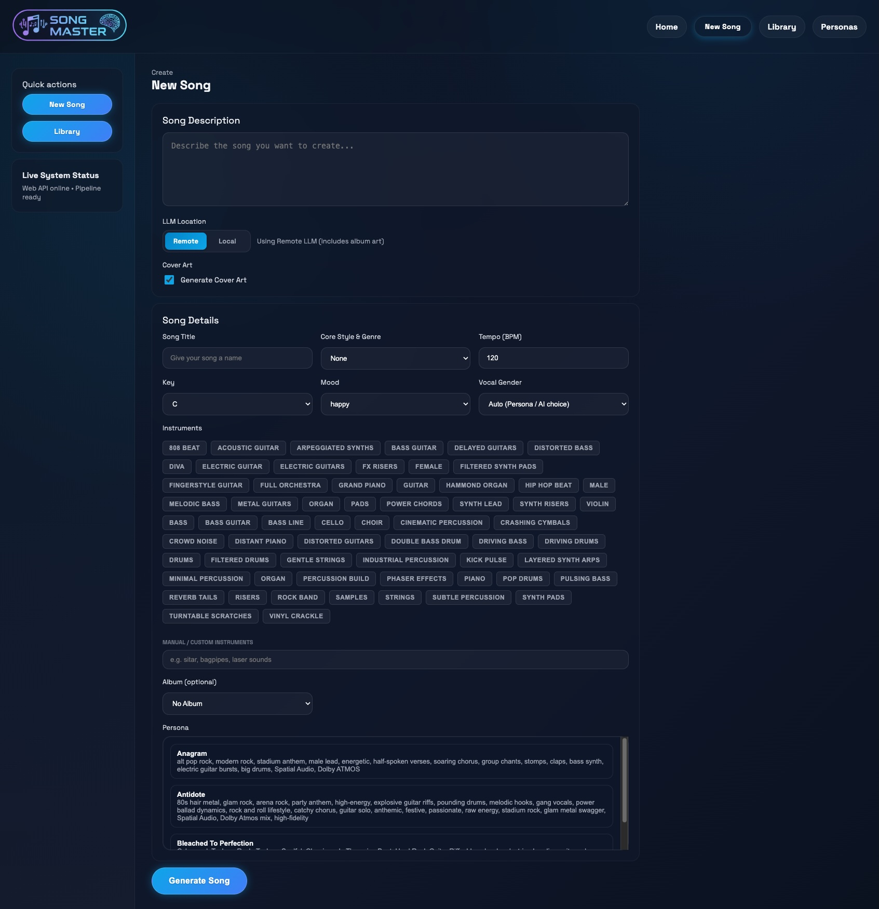
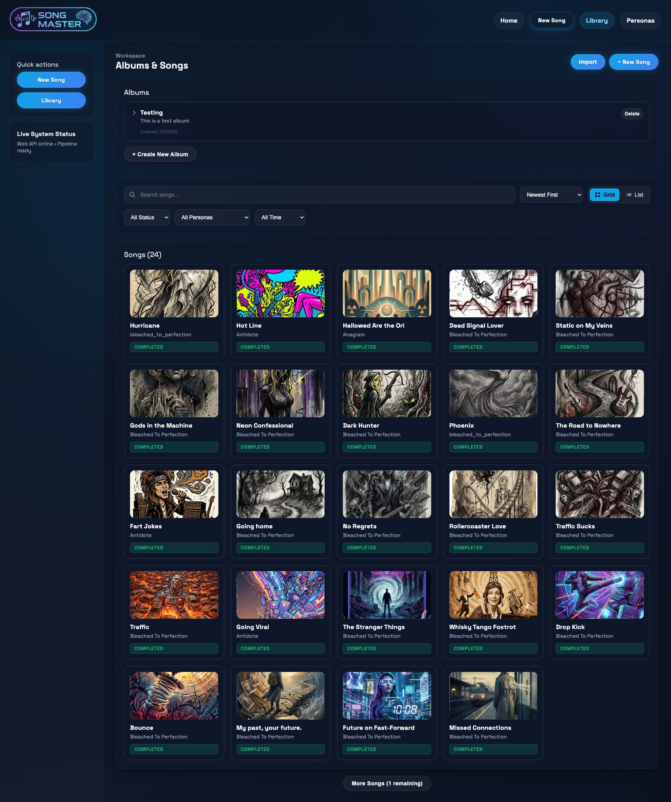
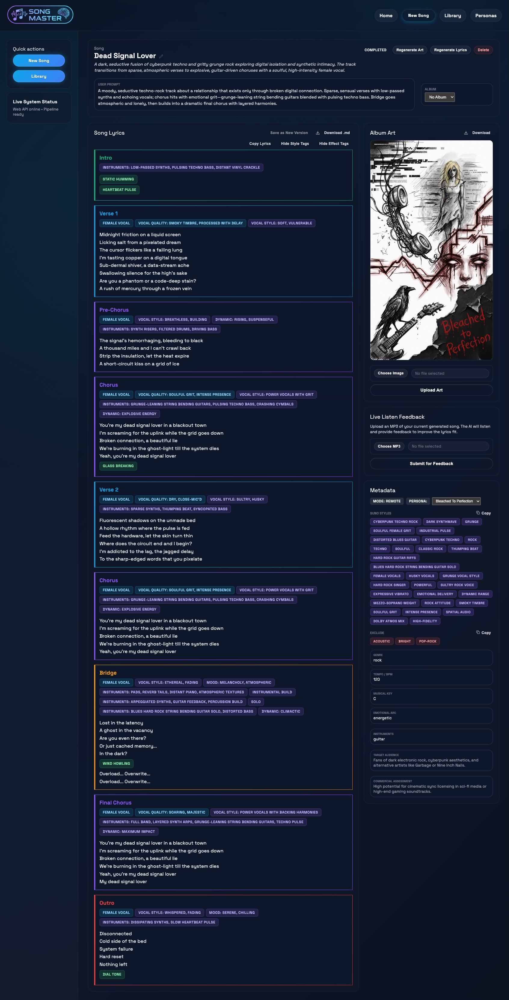
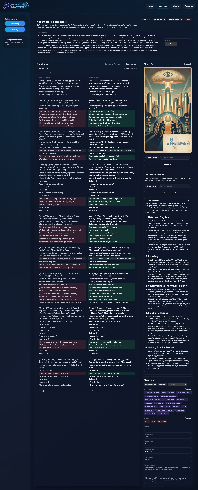
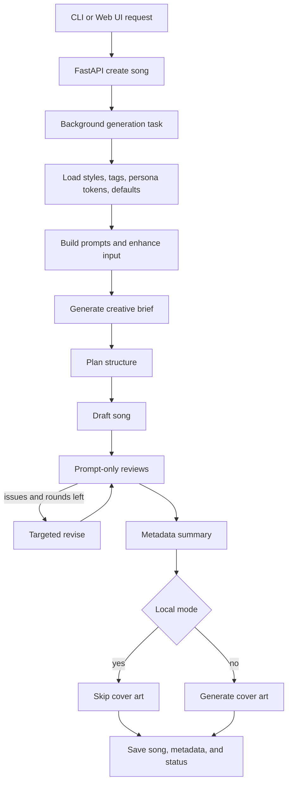

# Song Master

A powerful (yet easy to use) script for generating song lyrics using AI models, specifically designed for creating Suno AI-compatible songs with custom styles, metadata, and structured formatting.

## Overview

Song Master is a Python script that leverages AI models (both local and OpenRouter) to generate complete song lyrics with proper formatting, style tags, and metadata for Suno AI. It includes pre-flight checks, song drafting, and review processes to ensure high-quality output.

## Web GUI (FastAPI + React)

An initial web experience now lives alongside the CLI. The backend is a FastAPI app that mirrors the CLI pipeline, and the frontend is a Vite + React TypeScript UI shaped by the wireframes in `docs/`.

Quick start:
- Backend: `uvicorn backend.app.main:app --reload --host 0.0.0.0 --port 8000`
- Frontend: `cd frontend && npm install && npm run dev` (set `VITE_API_BASE` if the API is not on `http://localhost:8000`)
- API docs: `http://localhost:8000/docs`
- CLI generation now delegates to the backend API, so start the FastAPI server first (set `SONG_MASTER_API_BASE` in `.env` or pass `--api-base` to override).

Data is stored in `backend/data/song_master.db`. Personas/styles are read from the existing repo assets so the web app matches the CLI outputs.

### New Web GUI Features

The web UI now mirrors the CLI pipeline with richer editing, library management, and AI feedback tools:

<table>
  <tr>
    <th>Song Generation</th>
    <th>Dashboard + Library</th>
  </tr>
  <tr>
    <td valign="top">
      
    </td>
    <td valign="top">
      
    </td>
  </tr>
  <tr>
    <td valign="top">
      <p>Build a new song with persona selection, cover-art toggles, and detailed musical controls for tempo, key, mood, and instruments.</p>
    </td>
    <td valign="top">
      <p>Browse albums and songs with search, filters, and grid/list views. Import existing markdown and jump back into the workflow fast.</p>
    </td>
  </tr>
  <tr>
    <th>Song Detail + Live Listen</th>
    <th>Expanded Song Detail</th>
  </tr>
  <tr>
    <td valign="top">
      
    </td>
    <td valign="top">
      
    </td>
  </tr>
  <tr>
    <td valign="top">
      <p>Edit titles and descriptions inline, manage lyrics and versions, upload or regenerate album art, and submit MP3s for "Live Listen" feedback.</p>
    </td>
    <td valign="top">
      <p>Deep lyric navigation with section highlights, metadata chips, live feedback history, and album art previews.</p>
    </td>
  </tr>
</table>

**Key GUI Highlights:**
- **Editable Song Detail**: Inline title/description updates, lyric versioning, and diff views
- **Library Management**: Album grouping, search, filters, and grid/list toggles
- **Persona Workflow**: Manage personas and apply them during generation
- **Live Listen Feedback**: Upload MP3s for AI feedback and lyric refresh
- **Album Art Controls**: Regenerate, upload, and download cover art assets

## Table of Contents

- [Features](#features)
- [Installation](#installation)
- [Usage](#usage)
  - [Basic Usage](#basic-usage)
  - [With Local Model](#with-local-model)
  - [With Prompt File](#with-prompt-file)
  - [With Custom Song Name](#with-custom-song-name)
  - [With Persona](#with-persona)
  - [Regenerate Cover Art](#regenerate-cover-art)
  - [Command Line Options](#command-line-options)
- [Examples](#examples)
  - [Example Input](#example-input)
  - [Local Model Output](#local-model-output)
  - [OpenRouter Model Output](#openrouter-model-output)
  - [Cover Art Output](#cover-art-output)
  - [Key Differences Between Models](#key-differences-between-models)
- [Configuration](#configuration)
  - [Environment Variables](#environment-variables)
  - [Custom Styles](#custom-styles)
- [Technical Deep Dive: Agentic Songwriting Flow](#technical-deep-dive-agentic-songwriting-flow)
- [Album Structure](#album-structure)
- [Contributing](#contributing)
- [License](#license)
- [Support](#support)

## Features

- **Dual AI Support**: Works with both local AI models and OpenRouter API
- **Structured Output**: Generates Suno AI-compatible format with styles, metadata, and lyrics
- **Pre-flight Checks**: Validates prompts and suggests improvements before generation
- **Custom Styles**: Supports custom style definitions and tagging
- **Metadata Generation**: Automatically generates emotional arc, target audience, and commercial potential data
- **Review Process**: Built-in song review and refinement capabilities

## Installation

### Option 1: Docker Compose (Recommended)

1. Clone the repository:
```bash
git clone https://github.com/your-username/song-master.git
cd song-master
```

2. Set up environment variables:
```bash
cp .env.example .env
# Edit .env with your API keys and configuration
```

3. Start all services with Docker Compose:
```bash
docker-compose up
```

4. Access the application:
   - Frontend: http://localhost:5173
   - Backend API: http://localhost:8000
   - API Documentation: http://localhost:8000/docs

### Option 2: Local Development

1. Clone the repository:
```bash
git clone https://github.com/your-username/song-master.git
cd song-master
```

2. Install Python dependencies:
```bash
pip install -r requirements.txt
pip install -e .
```

3. Install frontend dependencies:
```bash
cd frontend && npm install
```

4. Set up environment variables:
```bash
cp .env.example .env
# Edit .env with your API keys and configuration
```

5. Start the backend:
```bash
uvicorn backend.app.main:app --reload --host 0.0.0.0 --port 8000
```

6. Start the frontend (in a new terminal):
```bash
cd frontend && npm run dev
```

## Usage

### Basic Usage

```bash
song-master "Your song prompt here"
```

### With Local Model

```bash
song-master "Your song prompt here" --local
```

### With Prompt File

```bash
song-master --prompt-file path/to/prompt.txt
```

### With Custom Song Name

```bash
song-master "Your song prompt here" --name "My Song Title"
```

### With Persona

```bash
song-master "Your song prompt here" --persona "antidote"
```

### Regenerate Cover Art

```bash
song-master --regen-cover path/to/song.md
```

### Command Line Options

- `prompt`: The song description or request (optional if using --prompt-file)
- `--prompt-file`: Path to a .txt file containing the song description
- `--local`: Use local LM Studio LLM and disable image generation
- `--name`: Optional song name/title
- `--persona`: Specify persona by name or path to persona .md file
- `--regen-cover`: Path to existing song file to regenerate album art

## Examples

### Example Input

The following input was used to generate the example outputs:

```
Generate some lyrics for a song that's all about testing ideas. Make it in the style of an 80s hair band and give it a thumping beat.
```

### Local Model Output

The local model generates a more narrative-focused song with detailed storytelling:

**Audio Sample:**

[](https://suno.com/song/8499a320-90b9-45ac-8b42-9a33816943a7)

```markdown
## Testing Ideas
### A powerful 80s hair metal anthem about confronting inner doubts and boldly testing personal truths, driven by explosive guitar riffs, pounding drums, and a soaring, anthemic chorus. The song blends raw emotional intensity with glam rock swagger and stadium-ready energy.

## Suno Styles
80s hair metal, glam rock, arena rock, explosive guitar riffs, pounding drums, anthemic, party anthem, high-energy, melodic hooks, gang vocals, power ballad dynamics, rock and roll lifestyle, catchy chorus, guitar solo, festive, passionate, raw energy, stadium rock, glam metal swagger, Spatial Audio, Dolby Atmos mix, high-fidelity

## Suno Exclude-styles
melodic hooks, catchy chorus

## Additional Metadata
- **Emotional Arc**: happy
- **Target Audience**: Fans of classic 80s rock, arena rock enthusiasts, and listeners who enjoy high-energy, emotionally charged performances with a nostalgic edge.
- **Commercial Potential**: High — ideal for rock radio, sports events, and nostalgic playlists, with strong potential as a viral anthem for self-empowerment and personal breakthrough.
- **Technical Notes**: BPM: 120, Key: C, Instruments: guitar,bass,drums
- **User Prompt**: Generate some lyrics for a song that's all about testing ideas. Make it in the style of an 80s hair band and give it a thumping beat.

### Song Lyrics:
## Testing Ideas

[Verse 1]  
Cracked coffee cup on the kitchen sink,  
Steam still rising—water's been cold for hours.  
A letter folded twice in my coat pocket—  
The name I wrote, then erased, then rewrote.  
Saw it in the subway light,  
A face I still see in every mirror.  
No map, no proof—just the weight of a word  
I've carried since the night you left.

[Pre-Chorus]  
I don't need a name,  
I don't need a stage—  
The silence broke, and my voice found its way.  
Got the wound, got the truth,  
Gonna say it now—no more running.

[Chorus]  
Feel the rush, feel the rise—  
No fear, no lie—just the truth that won't stay quiet.  
One breath, and the air went still—  
The world held its breath, and I heard my own name.  
Yeah, I'm testin' ideas,  
Gonna break the mold, gonna make it real—  
One word, and the silence breaks.

[Verse 2]  
Wired for waiting, built for the pause,  
Got a line I've written, and I'm gonna say it.  
From the train's cold hum to the stair's worn wood,  
From the silence to the breath I've been afraid to say.  
I don't care if it's right or wrong—  
If it breaks, it's already strong.  
Got a rhythm in my throat,  
A truth I've been afraid to speak—  
And I've been told I'm too soft to be heard.

[Pre-Chorus]  
I don't need a plan,  
I don't need a plan—  
The silence broke, and my voice found its way.  
Got the fire, got the drive,  
Gonna light it up, gonna give it life.

[Chorus]  
Feel the rush, feel the rise—  
No fear, no lie—just the truth that won't stay quiet.  
One breath, and the air went still—  
The world held its breath, and I heard my own name.  
Yeah, I'm testin' ideas,  
Gonna break the mold, gonna make it real—  
One word, and the silence breaks.

[Bridge]  
No second guess, no time to wait—  
The world's a cup, and I'm the hand that holds it.  
I don't need a name, I don't need a crown—  
Just the word I've been afraid to say.

[Guitar Solo — bendy, bluesy, soaring over pounding drums]  
[Big Finish]  
[Explosive Riff]  
[Choir]  
[Male Vocal]  
[Chorus — Gang Vocals, Anthemic, Full Band]  
Feel the rush, feel the rise—  
No fear, no lie—just the truth that won't stay quiet.  
One breath, and the air went still—  
The world held its breath, and I heard my own name.  
Yeah, I'm testin' ideas,  
Gonna break the mold, gonna make it real—  
One word, and the silence breaks.

[Outro]  
[Fade Out and End]  
[End]  
[Big Finish]  
[Powerful Outro]  
[Fading, layered, triumphant]
```

### OpenRouter Model Output

The OpenRouter model generates a more energetic, performance-focused song with explicit style tags:

**Audio Sample:** 

[](https://suno.com/song/c1c907b3-c84a-439b-b68b-f8dc0336263d)

```markdown
## Testing Ideas
### High‑energy 80s hair‑metal anthem about bold creativity and pushing ideas into the spotlight with swagger and arena‑rock power.

## Suno Styles
80s hair metal, glam rock, arena rock, anthemic, high-energy, glam metal, party anthem, explosive guitar riffs, pounding drums, melodic hooks, gang vocals, power ballad dynamics, rock and roll lifestyle, catchy chorus, guitar solo, festive, passionate, raw energy, stadium rock, glam metal swagger, Spatial Audio, Dolby Atmos mix, high-fidelity

## Suno Exclude-styles
None

## Additional Metadata
- **Emotional Arc**: happy
- **Target Audience**: Fans of 80s rock, glam metal, and energetic stadium‑style anthems.
- **Commercial Potential**: Strong potential for nostalgia‑driven rock playlists and high‑energy promotional use.
- **Technical Notes**: BPM: 120, Key: C, Instruments: guitar,bass,drums
- **User Prompt**: Generate some lyrics for a song that's all about testing ideas. Make it in the style of an 80s hair band and give it a thumping beat.

### Song Lyrics:
## Testing Ideas

[Intro] [style: 80s hair metal, glam rock, arena rock, party anthem, high-energy]  
Lights rise, crowds surge, hearts rumble through the night  
We cut the neon haze, break open the sky's white  

[Verse 1] [style: 80s hair metal]  
Got a wild plan ridin' on the restless air  
Clear visions sparkin' as the brave ones dare  
Chasin' echoes down a half‑lit road  
Every bold impulse primed to overload  

[Pre-chorus] [style: glam rock]  
Turn it up, turn it up, feel the pull draw near  
Unchained heartbeats roarin' loud and clear  

[Chorus] [style: arena rock, anthemic]  
We're breakin' the silence, makin' truth reveal  
Pushin' the edge till the moment feels real  
Cut through the doubt, shake off the old fear  
Lift your voice high — we're breakin' the silence  

[Verse 2] [style: hair metal swagger]  
Got a live spark rollin' through the riff  
A shockwave risin' with a skyline lift  
Every wrong turn feeds fire to our mark  
We carve our path with voices cuttin' the dark  

[Pre-chorus] [style: glam metal]  
Turn it up, turn it up, let the weight fall free  
Every strike we throw's a raw victory  

[Chorus] [style: arena rock, anthemic]  
We're breakin' the silence, makin' truth reveal  
Pushin' the edge till the moment feels real  
Cut through the doubt, shake off the old fear  
Lift your voice high — we're breakin' the silence  

[Guitar Solo — wild, bend-heavy, high-energy]

[Bridge] [style: power ballad dynamics]  
When the world says "stop," we just shout back "go!"  
Every spark hits harder, drivin' through the low  
Hold tight to the madness, feel the quake come down  
We light the whole sky up every time we stand our ground  

[Chorus] [style: arena rock + gang vocals]  
We're breakin' the silence, makin' truth reveal  
Pushin' the edge till the moment feels real  
Cut through the doubt, shake off the old fear  
Lift your voice high — we're breakin' the silence  

[Big Finish]  
Breakin' the silence — keep shoutin' through the years!
```

## Key Differences Between Models

| Aspect | Local Model (Qwen3 30B A3B 2507) | OpenRouter Model (GPT-5.1 CHAT) |
|--------|-------------|------------------|
| **Style** | More narrative and emotional | More energetic and performance-focused |
| **Structure** | Traditional verse-chorus structure | Explicit style tags per section |
| **Content** | Storytelling with personal elements | Direct and energetic messaging |
| **Formatting** | Standard formatting | Detailed style annotations |
| **Exclude Styles** | Specific exclusions (melodic hooks, catchy chorus) | No exclusions |

### Cover Art Output

The script also generates cover art for the songs using Nano Banana on OpenRouter. Here's an example of the cover art created for the "Testing Ideas" song:


## Configuration

### Environment Variables

Create a `.env` file with the following variables:

```env
# OpenRouter API Key (optional, for OpenRouter provider)
OPENROUTER_API_KEY=your_api_key_here

# LiteLLM Configuration (preferred for remote usage)
LITELLM_MODEL=openrouter/openai/gpt-5.1-chat
LITELLM_API_KEY=your_api_key_here
LITELLM_API_BASE=https://openrouter.ai/api/v1

# Local Model Configuration (LM Studio)
LMSTUDIO_API_KEY=lm-studio
LMSTUDIO_BASE_URL=http://localhost:1234/v1
LMSTUDIO_LLM_MODEL=your_model_name

# Generation Settings
LLM_MAX_TOKENS=4096
LLM_TEMPERATURE=0.7

# API base for CLI/HTTP clients (FastAPI)
SONG_MASTER_API_BASE=http://localhost:8000
```

### Custom Styles

Edit `styles/styles.json` to add custom style definitions:

```json
{
  "custom_styles": {
    "your_style": {
      "description": "Description of your style",
      "tags": ["tag1", "tag2", "tag3"],
      "exclude_tags": ["exclude1"]
    }
  }
}
```

## Technical Deep Dive: Agentic Songwriting Flow
The agentic process implemented via LangGraph still powers Song Master, but the ownership boundary has changed. The CLI is now a thin client that submits work to the FastAPI backend; the backend owns the real generation lifecycle and persists progress, lyrics, metadata, and assets for both the web UI and CLI callers.

- **CLI client (`cli/song_master.py`)**: Installed as the `song-master` console script, it parses prompt/name/persona/local flags, calls `/api/songs/generate`, polls `/api/songs/{id}/status`, fetches the final record, and optionally saves a local markdown copy for convenience.

- **Backend task manager (`backend/app/services/song_generator.py`)**: Creates the initial song row, starts an in-process background task, caches progress updates, and writes final results back to the database and filesystem.

- **Pipeline orchestration (`backend/app/services/song_pipeline.py`)**: A LangGraph `StateGraph` wires together the agentic steps and keeps shared state (lyrics, score, metadata, persona, resources, and round counters).

- **Resource loading (`helpers.load_resources`)**: Styles from `styles/styles.json`, tag snippets in `tags/*.txt`, persona-specific style tokens from `personas/*.md`, and baseline song params (genre/tempo/key/instruments/mood). Persona style tokens get re-used later to bias metadata and tags.

- **Prompt assembly (`ai_functions.build_prompts`)**: The brief/structure/drafter/reviewer/revision/metadata prompts are built once, with the styles/tags/persona tokens inlined so every call has the same grounding data.

- **Planning + drafting (`brief_node` → `structure_node` → `draft_node`)**: The backend first asks the model for a creative brief, then a locked section plan, then the lyric draft itself. The drafter follows the structure returned by the planner directly instead of a deterministic blueprint or repair pass.

- **Prompt-only review loop (`review_node` → `targeted_revise_node`)**: Theme, quality, and Suno-format reviewers run in parallel threads, their issues are merged into one edit plan, and `revise_lyrics` applies that plan. The graph loops until no meaningful issues remain or `REVIEW_MAX_ROUNDS` is exhausted.

- **Metadata + cover art (`metadata_node` → `album_art_node`)**: The metadata agent emits JSON (description, Suno styles/exclude, target audience, commercial potential) and injects persona style tokens to keep the song "on persona." Album art is generated unless `--local` is set; regeneration can be run directly with `--regen-cover`.

- **Persistence (`save_node`)**: The final song, metadata, and user prompt are saved to `songs/{YYYYMMDD}_{Title}.md`, with optional `{Title}_cover.jpg` beside it.



```mermaid
flowchart TD
    A[CLI or Web UI request] --> B[FastAPI create song]
    B --> C[Background generation task]
    C --> D[Load styles, tags, persona tokens, defaults]
    D --> E[Build prompts and enhance input]
    E --> F[Generate creative brief]
    F --> G[Plan structure]
    G --> H[Draft song]
    H --> I[Prompt-only reviews]
    I -->|issues and rounds left| J[Targeted revise]
    J --> I
    I --> K[Metadata summary]
    K --> L{Local mode}
    L -->|yes| M[Skip cover art]
    L -->|no| N[Generate cover art]
    M --> O[Save song, metadata, and status]
    N --> O
```


## Album Structure

```
song-master/
├── README.md                 # This file
├── pyproject.toml            # Package metadata and CLI entry point
├── cli/
│   ├── __init__.py
│   └── song_master.py        # CLI entry point
├── backend/
│   ├── app/                  # FastAPI backend
│   └── shared/               # Shared backend and CLI logic
├── requirements.txt          # Python dependencies
├── .env.example              # Environment variables template
├── examples/                 # Example outputs
│   ├── local/                # Local model examples
│   ├── openrouter/           # OpenRouter model examples
│   └── testing-ideas.txt     # Example input
├── prompts/                  # AI prompts
├── styles/                   # Style definitions
├── personas/                 # AI personas
├── tags/                     # Default tags
└── tools/                    # Utility scripts
  ├── check_requirements.py  # Dependency import check
  └── create_album_art.py   # Album art helper
```

## Contributing

1. Fork the repository
2. Create a feature branch
3. Make your changes
4. Add tests if applicable
5. Submit a pull request

## License

This album is licensed under the MIT License - see the LICENSE file for details.

## Support

For issues and questions:
- Create an issue on GitHub
- Check the examples directory for reference outputs
- Review the prompts directory for AI interaction templates
