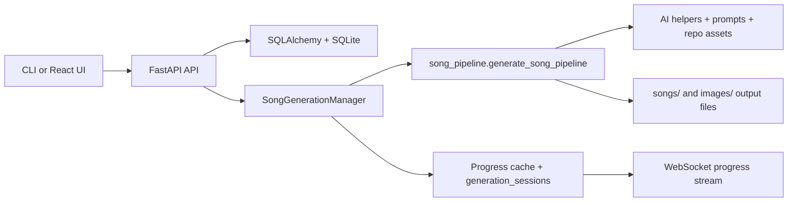

# Song Master Web GUI - Technical Architecture

## System Overview

Song Master currently ships as a small full-stack application:

- A FastAPI backend under `backend/app` exposes song, album, persona, settings, style, and progress endpoints.
- A Vite + React TypeScript frontend under `frontend/src` consumes that API.
- The CLI in `song_master.py` is now a thin HTTP client that submits work to the backend instead of running the LangGraph pipeline locally.
- The lyric-generation pipeline itself lives in `backend/app/services/song_pipeline.py` and is shared by the backend runtime.

This document describes the implementation that exists in the repository today. Future-state ideas should be documented separately so they are not confused with the shipped stack.

## Current Technology Stack

### Backend

- **Framework**: FastAPI
- **Validation**: Pydantic / pydantic-settings
- **Database**: SQLite via SQLAlchemy
- **Generation runtime**: in-process asyncio task manager plus thread-executed pipeline work
- **Real-time updates**: native WebSocket endpoint at `/ws/songs/{song_id}/progress`
- **Static assets**: FastAPI `StaticFiles` mounts for generated song folders and images

### Frontend

- **Framework**: React 18 with TypeScript
- **Build tool**: Vite
- **Routing**: React Router
- **Server state**: TanStack React Query
- **HTTP client**: Axios
- **Styling**: repo-owned CSS in `frontend/src/index.css` plus component-level inline styles
- **Real-time updates**: browser-native `WebSocket`

### Development Tooling

- **Frontend package manager**: npm (`package-lock.json` is committed)
- **Backend dependencies**: `requirements.txt`
- **Local orchestration**: `docker-compose.yml`

## Runtime Architecture



### Request Flow

1. The frontend or CLI sends a request to FastAPI.
2. FastAPI stores the initial song record in SQLite.
3. `SongGenerationManager` starts an in-process background task.
4. The manager runs `generate_song_pipeline(...)` in a worker thread.
5. Progress messages are cached in memory and exposed over HTTP status polling plus WebSocket updates.
6. Final lyrics, metadata, versions, and file references are persisted back into SQLite and the filesystem.

## Backend Structure

### Application Entry Point

- `backend/app/main.py`
  - Configures FastAPI and CORS
  - Initializes the database on startup
  - Registers routers
  - Mounts static folders for generated song and image assets

### API Routes

- `backend/app/api/routes/health.py`
  - Health endpoint
- `backend/app/api/routes/albums.py`
  - List, create, fetch, and delete albums
- `backend/app/api/routes/songs.py`
  - List songs
  - Fetch song details and status
  - Start generation
  - Import markdown
  - Update metadata and lyrics
  - Regenerate art or lyrics
  - Upload custom art
  - Submit Live Listen feedback
- `backend/app/api/routes/personas.py`
  - CRUD operations for persona markdown-backed content
- `backend/app/api/routes/settings.py`
  - Read-only consolidated settings payload for the frontend
- `backend/app/api/routes/styles.py`
  - List available core styles from `styles/styles.json`
- `backend/app/api/routes/instruments.py`
  - List available instruments

### Services

- `backend/app/services/song_generator.py`
  - Owns background task lifecycle
  - Caches live status
  - Persists generation sessions, song versions, and file records
- `backend/app/services/song_pipeline.py`
  - Owns the LangGraph-powered generation flow
  - Loads prompts and resources
  - Runs draft, review, critic, preflight, metadata, art, and save stages
- `backend/app/services/persona_service.py`
  - Reads and writes persona files
- `backend/app/services/settings_service.py`
  - Builds the frontend settings payload from environment variables and defaults
- `backend/app/services/live_listen_service.py`
  - Processes uploaded audio feedback and returns revised lyrics

### Data Layer

- `backend/app/db/`
  - SQLAlchemy base, session, and dependency wiring
- `backend/app/models/`
  - `Album`
  - `Song`
  - `SongFile`
  - `SongVersion`
  - `GenerationSession`
  - `User`
  - `UserSetting`
- `backend/app/schemas/`
  - Pydantic request and response models for the API

## Frontend Structure

```text
frontend/src/
├── components/
│   ├── common/
│   ├── layout/
│   └── ui/
├── features/
│   ├── generation/
│   ├── library/
│   ├── progress/
│   └── songViewer/
├── pages/
├── services/
├── types/
├── App.tsx
├── index.css
└── main.tsx
```

### Page-Level Responsibilities

- `LandingPage`
  - Recent songs and high-level product entry
- `DashboardPage`
  - Album list, song library, import, search, filter, sort, and view toggles
- `GeneratePage`
  - Hosts the generation form
- `SongDetailPage`
  - Inline edits, lyric versions, diff view, album art actions, and Live Listen feedback
- `PersonasPage`
  - Persona management UI

### Frontend State Model

- **Server state**: React Query for songs, albums, personas, styles, instruments, settings, and status polling
- **Component state**: local React state for form controls, editing sessions, modal state, selected versions, and upload flows
- **Progress updates**: native `WebSocket` with HTTP polling fallback when no WebSocket payload has arrived yet

## Generation Pipeline Ownership

The core songwriting flow is not owned by the CLI anymore.

- `song_master.py`
  - Parses CLI flags
  - Sends `/api/songs/generate`
  - Polls `/api/songs/{id}/status`
  - Fetches the final song record
  - Saves a local markdown copy for convenience
- `backend/app/services/song_pipeline.py`
  - Owns the LangGraph `StateGraph`
  - Loads personas, styles, tags, and prompt templates
  - Runs drafting, review rounds, critic pass, preflight, metadata, album art, and save steps

This separation means the web app and CLI now share the same backend execution path.

## Current Data Model

### Implemented Tables

- `albums`
  - Album container rows
  - `user_id` is currently nullable
- `songs`
  - Primary record for prompts, lyrics, metadata, score, status, and album assignment
  - `album_id` is currently nullable
- `song_files`
  - Tracks persisted lyric and artwork files
- `song_versions`
  - Snapshot history for lyric edits and regenerations
- `generation_sessions`
  - Stores progress and log history for generation runs
- `users`
  - Present in the model layer, but not currently exposed through an authentication API
- `user_settings`
  - Present in the model layer; current frontend settings are served from environment-derived config rather than a writeable user-settings workflow

### Relationship Notes

- Deleting an album preserves songs by allowing `songs.album_id` to become `NULL`.
- Song versions are appended when lyrics are edited or regenerated.
- Generation progress is available both from in-memory status cache and from persisted `generation_sessions` records.

## File and Asset Storage

### Current Storage Locations

- Database: `backend/data/song_master.db`
- Generated song markdown and related assets: `songs/`
- Generated and uploaded artwork: `images/` plus song-specific asset paths
- Personas: `personas/`
- Styles: `styles/styles.json`
- Prompt templates: `prompts/`

### Runtime Behavior

- The backend ensures `songs/` and `images/` exist on startup.
- Generated songs are saved to the repository filesystem, not an object store.
- FastAPI mounts `/songs` and `/images` so the frontend can render generated assets directly.

## Real-Time Progress Model

### Backend

- `SongGenerationManager` maintains an in-memory `progress_cache`.
- Each generation also writes a `generation_sessions` row.
- The WebSocket route sends the latest cached status every 500 ms while connected.

### Frontend

- `LiveProgress` opens a native `WebSocket`.
- If the socket has not produced a payload yet, the UI falls back to polling `/api/songs/{id}/status`.
- Logs, current stage, progress percentage, and failure state are rendered from the same status model.

## Local Development and Deployment

### Docker Compose

The checked-in `docker-compose.yml` starts:

- `backend`
  - FastAPI container
  - Mounts `backend`, `backend/data`, `personas`, `styles`, `prompts`, `songs`, and `images`
- `frontend`
  - Vite dev server container
  - Mounts `frontend`

There is currently no Redis, Celery worker, or separate queue service in the repository's default runtime.

### Direct Local Run

- Backend: `uvicorn backend.app.main:app --reload --host 0.0.0.0 --port 8000`
- Frontend: `cd frontend && npm install && npm run dev`

## Current Gaps and Future Work

The repository has room to grow, but these items are not implemented today:

- JWT-based authentication and multi-user session flows
- External task queue / worker separation
- Redis-backed caching or pub-sub
- Writeable settings persistence from the frontend
- Notification WebSocket channels beyond song progress
- Production-specific deployment topology beyond the current local Docker setup

Those can be documented as roadmap items when they are introduced, but they should not be treated as part of the present architecture until the code exists.
