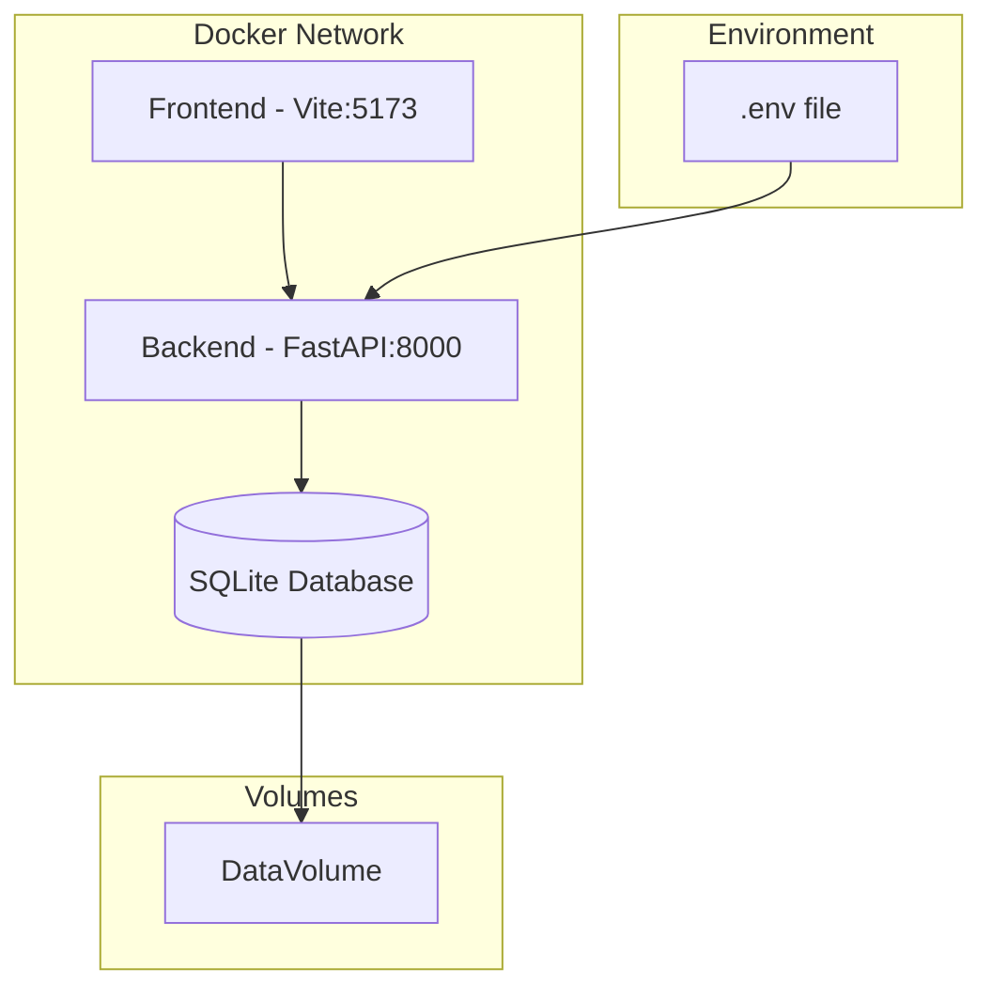

# Docker Compose Conversion Plan

## Overview

Convert the project from a devcontainer-based development setup to a docker compose configuration with separate services for backend, frontend, and database.

## Current Architecture

### DevContainer Configuration
- **Base Image**: `mcr.microsoft.com/vscode/devcontainers/python:3.12`
- **Post-install**: Installs Tesseract OCR, poppler-utils, Python dependencies
- **Environment Variables**: API keys passed from host

### Current Project Structure
```
song-master/
├── backend/          # FastAPI application
├── frontend/         # React + Vite application
├── .devcontainer/    # Dev container config
├── requirements.txt  # Python dependencies
└── start.sh          # Startup script
```

## Target Architecture



## Implementation Plan

### 1. Create Dockerfile.backend

**Purpose**: Containerize the Python/FastAPI backend

**Key Requirements**:
- Python 3.12-slim base image
- Install system dependencies: `tesseract-ocr`, `poppler-utils`
- Copy requirements.txt and install Python packages
- Copy backend application code
- Expose port 8000
- Set working directory to `/app`

**Location**: `Dockerfile.backend`

### 2. Create Dockerfile.frontend

**Purpose**: Containerize the React/Vite frontend

**Key Requirements**:
- Node.js 20-slim base image (multi-stage build)
- Stage 1: Build the React application
- Stage 2: Serve with nginx or use development server
- Expose port 5173 (dev) or 80 (production)
- For development: use npm run dev with hot reload

**Location**: `Dockerfile.frontend`

### 3. Create docker-compose.yml

**Purpose**: Orchestrate all services

**Services**:
- `backend`: Python/FastAPI service
- `frontend`: Node/React service
- `db`: SQLite database (file-based)

**Configuration**:
- Shared network between services
- Volume mounts for:
  - Backend code (for hot reload)
  - Frontend code (for hot reload)
  - Database file persistence
  - Persona files
  - Generated content
- Environment variables from `.env`
- Port mappings:
  - Backend: 8000:8000
  - Frontend: 5173:5173
- Healthchecks for both services
- Restart policies

### 4. Update .env.example

**Purpose**: Document required environment variables

**Variables to include**:
```
OPENROUTER_API_KEY=
LMSTUDIO_API_KEY=
LMSTUDIO_API_BASE=
DATABASE_URL=sqlite:///./backend/data/song_master.db
```

### 5. Update start.sh

**Purpose**: Adapt startup script for docker environment

**Changes**:
- Remove uvicorn background process (let docker manage processes)
- Use proper process management or CMD in Dockerfile
- Ensure proper signal handling

### 6. Add Healthchecks

**Backend Healthcheck**:
```yaml
healthcheck:
  test: ["CMD", "curl", "-f", "http://localhost:8000/health"]
  interval: 30s
  timeout: 10s
  retries: 3
```

**Frontend Healthcheck**:
```yaml
healthcheck:
  test: ["CMD", "curl", "-f", "http://localhost:5173"]
  interval: 30s
  timeout: 10s
  retries: 3
```

### 7. Update README.md

**Purpose**: Document the new development workflow

**Sections to add**:
- Prerequisites (Docker, Docker Compose)
- Quick Start Guide
- Environment Setup
- Development Commands
- Troubleshooting

## File Changes Summary

| File | Action | Description |
|------|--------|-------------|
| `Dockerfile.backend` | Create | Python backend container |
| `Dockerfile.frontend` | Create | Node/React frontend container |
| `docker-compose.yml` | Create | Service orchestration |
| `.env.example` | Update | Add missing variables |
| `start.sh` | Modify | Adapt for docker |
| `README.md` | Update | Document new workflow |
| `.devcontainer/` | Keep | For VS Code users who prefer devcontainers |

## Development Workflow

### Starting Development

```bash
# Copy environment file
cp .env.example .env

# Edit .env with your API keys
nano .env

# Start all services
docker-compose up --dev
```

### Accessing Services

- **Frontend**: http://localhost:5173
- **Backend API**: http://localhost:8000
- **API Documentation**: http://localhost:8000/docs

### Stopping Services

```bash
docker-compose down
```

### Viewing Logs

```bash
docker-compose logs -f
```

## Benefits of This Approach

1. **Multi-service orchestration**: Clear separation between frontend and backend
2. **Hot reload**: Code changes reflected immediately in containers
3. **Database persistence**: SQLite data survives container restarts
4. **Environment consistency**: Same configuration across all environments
5. **Production-ready**: Docker compose can be extended for production deployment
6. **Cross-platform**: Works on Windows, macOS, and Linux

## Next Steps

1. Review and approve this plan
2. Switch to Code mode for implementation
3. Create the Dockerfiles and docker-compose.yml
4. Test the configuration
5. Update documentation